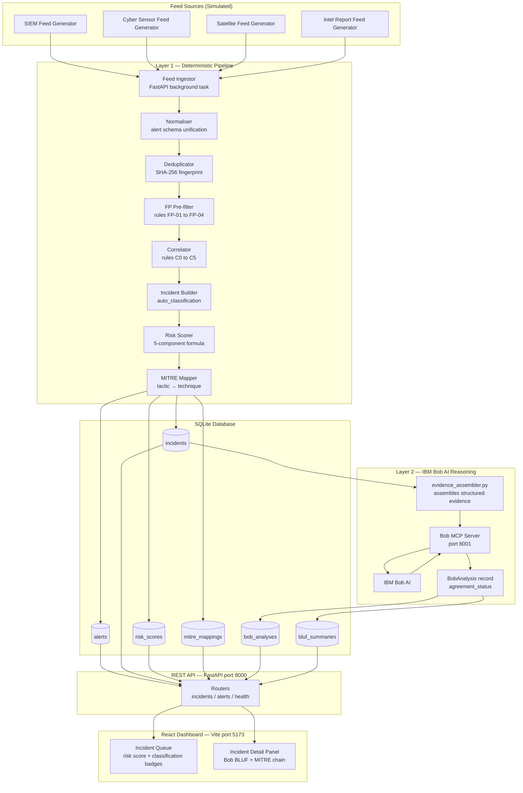

# Architecture

## System Architecture

The Infinity Threat Intelligence Fusion & Prioritisation Platform is organised into two fully independent layers: a deterministic processing pipeline (Layer 1) and an IBM Bob AI reasoning layer (Layer 2). Layer 2 reads Layer 1 outputs but never modifies them.

---

## Component Table

| Component | Technology | Responsibility |
|---|---|---|
| Feed Generators | Python (synthetic) | Produce simulated SIEM, cyber sensor, satellite, and intel report alert streams |
| Feed Ingestor | FastAPI background task | Receive raw feed payloads and pass to the processing pipeline |
| Normaliser | Python | Convert all raw alerts to a canonical `NormalisedAlert` schema |
| Deduplicator | Python + SHA-256 | Compute fingerprints and link duplicate alerts to canonical records |
| FP Pre-filter | Python (rule engine) | Apply FP-01–FP-04 rules to mark low-credibility alerts as FP_CANDIDATE |
| Correlator | Python (rule engine) | Apply C0–C5 rules to group alerts into incident candidates |
| Incident Builder | Python | Construct `Incident` records with auto_classification and classification_reason |
| Risk Scorer | Python | Compute 5-component weighted risk score; store components separately |
| MITRE Mapper | Python + ATT&CK data | Map incidents to MITRE tactic/technique/sub-technique with confidence scores |
| SQLite Database | SQLite + SQLAlchemy | Persist all alerts, incidents, scores, mappings, and Bob analyses |
| Evidence Assembler | Python | Build the structured evidence package delivered to Bob via MCP |
| Bob MCP Server | Python (MCP) | Expose tool endpoints to IBM Bob; handle tool call routing |
| IBM Bob AI | IBM Bob | Independently classify threats, explain scores, review correlation rules, generate BLUF |
| REST API | FastAPI + Pydantic v2 | Serve all data to the frontend; expose Bob analysis trigger endpoint |
| React Dashboard | React 18 + Vite + TailwindCSS | Present incident queue, detail panels, MITRE chains, and Bob assessments |

---

## Data Flow

1. **Feed generators** emit raw alert JSON payloads at configurable intervals (default: every 10–30 seconds per source).
2. The **Feed Ingestor** receives each payload and immediately passes it to the `Normaliser`.
3. The **Normaliser** transforms the raw payload into a `NormalisedAlert` with a unified schema (severity 0.0–1.0, confidence 0.0–1.0, canonical IOC list, geo_region, threat_actor_hint).
4. The **Deduplicator** computes a SHA-256 fingerprint and checks the `alerts` table. Duplicates are linked; unique alerts are persisted.
5. The **FP Pre-filter** evaluates each new alert and writes an `fp_candidate` flag + `fp_reason_code` to the `alerts` table.
6. The **Correlator** evaluates the sliding alert window (configurable, default: 30 minutes) against each of rules C0–C5. When a rule fires, it passes the matching alert set to the **Incident Builder**.
7. The **Incident Builder** writes an `Incident` record to the `incidents` table with `auto_classification` and `auto_classification_reason`.
8. The **Risk Scorer** computes the five score components, stores them in `risk_scores`, and writes the composite score back to the incident.
9. The **MITRE Mapper** queries the local ATT&CK JSON dataset, selects the best tactic/technique matches, and writes results to `mitre_mappings`.
10. Steps 1–9 happen automatically in the background on every incoming alert.
11. **Bob AI review** is triggered explicitly: the analyst presses "Analyse with Bob" in the UI (or via `POST /incidents/{id}/analyse`). The `evidence_assembler.py` queries the DB for all Layer 1 data, packages it as structured JSON, and submits it to the Bob MCP Server.
12. The MCP server dispatches the four Bob tool calls sequentially (`classify_threat` → `score_explanation` → `correlation_review` → `generate_bluf`) and writes the `BobAnalysis` record to `bob_analyses`.
13. The **REST API** serves the combined record (incident + risk score + MITRE mappings + Bob analysis) to the **React Dashboard** via `GET /incidents/{id}`.
14. The dashboard renders both the deterministic pipeline decision and Bob's assessment side-by-side. `agreement_status = DISAGREES` is highlighted in amber.

---

## Security Notes

- All API keys and secrets (`BOB_API_KEY`, `API_KEY`) are stored in environment variables and never committed to the repository. `src/.env` is in `.gitignore`.
- The backend API validates the `X-API-Key` header on all write endpoints. The development default key is `dev-key-infinity` — replace in production.
- CORS origins are restricted via the `CORS_ORIGINS` environment variable (default: `http://localhost:5173`).
- SQLite database file (`infinity_threat.db`) is stored locally inside the container at `/app/data/` and is not exposed over the network.
- IBM Bob API calls are made server-side (from the MCP server) only — the Bob API key is never sent to the browser.
- All Bob inputs are assembled by `evidence_assembler.py` from DB records; Bob cannot receive user-supplied free text that could lead to prompt injection.

---

## Scalability Notes

The prototype is designed for local and Docker deployment. For production scale:

- The FastAPI backend is stateless and can be horizontally scaled behind a load balancer. Switching `DATABASE_URL` to PostgreSQL requires no application code changes.
- The Bob MCP server can be scaled independently; MCP calls are already asynchronous.
- The synthetic feed generator can be replaced with real feed connectors (STIX/TAXII, syslog, REST webhooks) by implementing the `FeedAdaptor` interface in `src/backend/feeds/`.
- SQLite's write lock becomes a bottleneck above ~100 concurrent writes/second; migration to PostgreSQL is the first scaling step.
